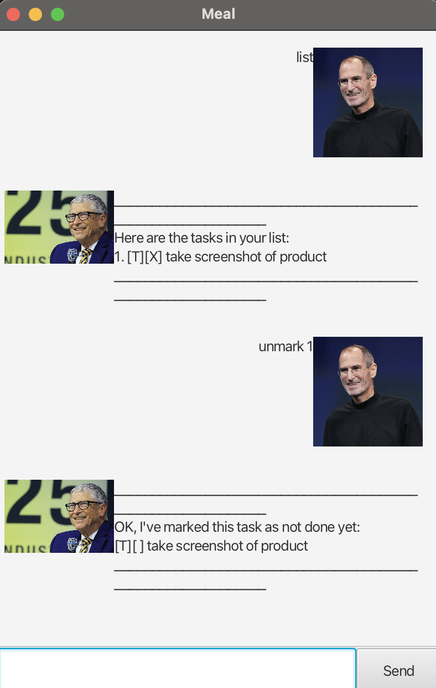

# Meal User Guide



Meal is your personal task manager chatbot. It helps you keep track of todos, deadlines, and events through a friendly chat interface.

## Adding todo

Adds a todo task to the to do list

Format:
```
todo TASKNAME
```
Example:
```
todo take a shower
```
Expected output:
```
Got it. I've added this task:
[T][] take a shower
Now you have 1 tasks in the list.
```

## Adding deadline

Adds a deadline task to the to do list

Format:
```
deadline TASKNAME /by YYYY-MM-DD
```
Example:
```
deadline study for exam /by 2025-09-21
```
Expected output:
```
Got it. I've added the task:
[D][] study for exam (by: Sep 21 2025)
Now you have 2 tasks in the list.
```

## Adding event

Adds an event task to the to do list

Format:
```
event TASKNAME /from YYYY-MM-DD /to YYYY-MM-DD
```
Example:
```
event finals /from 2025-10-21 /to 2025-10-28
```
Expected output:
```
Got it. I've added the task:
[E][] finals (from: Oct 21 2025 to: Oct 28 2025)
Now you have 3 tasks in the list.
```

## Listing tasks

Shows a list of all tasks

Format:
```
list
```
Example:
```
list
```
Expected output:
```
Here are the tasks in your list:
1. [T][] take a shower
2. [D][] study for exam (by: Sep 21 2025)
3. [E][] finals (from: Oct 21 2025 to: Oct 28 2025)
```

## Deleting tasks

Deletes one task from the list (by index)

Format:
```
delete INDEX
```
Example:
```
delete 2
```
Expected output:
```
Got it. I've removed this task:
[D][] study for exam (by: Sep 21 2025)
Now you have 2 tasks in the list.
```

## Marking tasks

Marks a task as done

Format:
```
mark INDEX
```
Example:
```
mark 1
```
Expected output:
```
Nice! I've marked this task as done:
[T][X] take a shower
```

## Unmarking tasks

Unmarks a task

Format:
```
unmark INDEX
```
Example:
```
unmark 1
```
Expected output:
```
OK, I've marked this task as not done yet:
[T][] take a shower
```

## Finding tasks

Shows a list of tasks with the relevant keyword

Format:
```
find TASKNAME
```
Example:
```
find shower
```
Expected output:
```
Here are the matching tasks in your list:
1. [T][] take a shower
```

## Showing all commands

Shows a list of all commands and their usage

Format:
```
help
```
Example:
```
help
```
Expected output:
```
Commands:
list
todo <name>
deadline <name> /by <yyyy-mm-dd>
event <name> /from <start> /to <end>
delete <index>
mark <index> / unmark <index>
find <keyword>
help
bye
```

## Exit program

Exits the program

Format:
```
bye
```
Example:
```
bye
```
Expected output:
```
Bye. Hope to see you again soon!
```